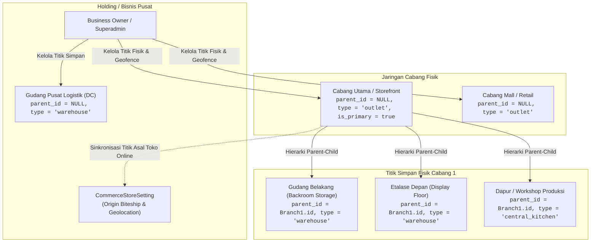
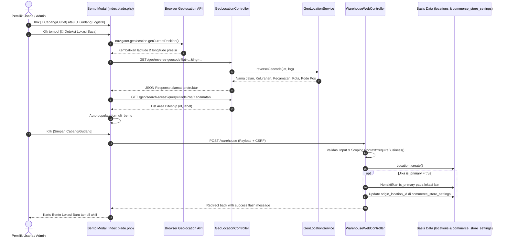

# Alur & Panduan Teknis: Manajemen Cabang, Outlet, dan Gudang Logistik Terpadu (Warehouse Management Hub)

> **Status:** CURRENT STATE & ARCHITECTURAL SPECIFICATION  
> **Terakhir Diverifikasi:** 2026-09-27  
> **Ruang Lingkup:** `resources/views/app/warehouse/index.blade.php`, `resources/views/app/warehouse/show.blade.php`, `WarehouseWebController`, `InventoryWebController`, `GeoLocationController`, `Location`, `InventoryStock`, `StockMovement`, `GoodsReceipt`, `CommerceStoreSetting`.

---

## 1. Latar Belakang & Nilai Bisnis

Struktur operasional fisik bisnis UMKM di Indonesia berkembang secara dinamis dari skala gerai tunggal (*single outlet*) menjadi jaringan multi-cabang dengan berbagai titik penyimpanan (*multi-warehouse*). Masalah umum yang dihadapi pemilik usaha:
1. **Ketidaksinkronan Stok Fisik vs Catatan:** Barang yang tersimpan di gudang belakang (*storage*) atau etalase depan kasir sering kali tidak tercatat secara terpisah, sehingga kasir tidak mengetahui apakah barang habis atau hanya belum dipajang.
2. **Ketiadaan Geofencing Absensi:** Karyawan toko/cabang dapat melakukan absensi dari rumah jika sistem tidak membatasi radius presensi berbasis koordinat GPS nyata gerai fisik.
3. **Keterbatasan Ekspedisi Online Storefront:** Toko online multi-cabang membutuhkan satu titik penjemputan (*pickup origin*) resmi yang terhubung ke API kurir nasional (Biteship) agar tarif ongkir kurir akurat secara otomatis.
4. **Celah Fraud Penyesuaian Stok (Shrinkage / Penggelapan):** Staf operasional dapat dengan mudah mengubah kuantitas stok sistem menjadi 0 dengan dalih "rusak/hilang" tanpa otorisasi Supervisor PIN, tanpa Berita Acara, dan tanpa pencatatan jurnal kerugian ke buku besar akuntansi.

Modul **Warehouse Management Hub** di `resources/views/app/warehouse` dirancang untuk mengonsolidasi seluruh titik fisik bisnis (Cabang, Toko, Dapur Pusat, Pabrik, dan Gudang Logistik) dalam satu dashboard bento Apple HIG terpadu dengan penentuan hierarki, integrasi reverse-geocoding, pemantauan valuasi aset persediaan berbasis HPP, dan manajemen mutasi kartu stok.

---

## 2. Diagram Alur Visual & Interaksi Sistem

### Diagram Topologi & Hierarki Logistik


### Sequence Diagram: Hulu-ke-Hilir Registrasi & Deteksi Geolocation GPS


---

## 3. Rincian Rantai Eksekusi 11-Simpul (The 11-Node Chain)

| Simpul | Elemen Teknis | Implementasi Aktual & Verifikasi Kode |
|:---:|---|---|
| **1. Aktor & Persona** | Siapa yang menginisiasi aksi | Business Owner, General Manager, Manajer Logistik, Kepala Cabang, Staf Gudang. |
| **2. UI & Form State** | Titik masuk antarmuka | `resources/views/app/warehouse/index.blade.php` (Modal Tambah Cabang/Gudang, Edit, Geocoding) & `show.blade.php` (Tabel Stok, Quick Adjustment Modal, Tab Penerimaan PO). |
| **3. Route & Middleware** | Gerbang otentikasi & proteksi | `owner.php`: `middleware('module:inventory_warehouse')`, `require.permission:warehouse.view`, `require.permission:warehouse.manage`, `entitlement:warehouse`. |
| **4. Controller & Action** | Penanganan HTTP | `WarehouseWebController@index`, `@store`, `@show`, `@update`, `@destroy`, dan delegasi stok ke `InventoryWebController@quickAdjust`. |
| **5. Validasi Request** | Validasi skema & payload | Validasi inline di controller: `parent_id` (UUID valid milik tenant), `type` (outlet, warehouse, central_kitchen), `geofence_radius_meters` (10-10.000m), koordinat lat/lng. |
| **6. Domain Service** | Logika bisnis | `StockService::getOrCreateStock()`, `StockService::recordMovement()`, `GeoLocationService::reverseGeocode()`, `EntitlementService::canCreateLocation()`. |
| **7. Model & DB Schema** | Struktur persistensi | Tabel `locations` (`id`, `business_id`, `parent_id`, `name`, `type`, `code`, `is_primary`, `is_active`, `geofence_radius_meters`, `biteship_area_id`). |
| **8. Finansial & Jurnal** | Dampak buku besar | **GAP KRITIS:** Penyesuaian stok di `quickAdjust` belum memicu auto-journal beban selisih persediaan (Shrinkage Expense) ke General Ledger. |
| **9. Mutasi Stok & BOM** | Pemotongan & penambahan fisik | Pencatatan mutasi di `stock_movements` (tipe `adjustment` atau `goods_receipt`), pembaruan kuantitas di `inventory_stocks`. |
| **10. Notifikasi Tri-Channel** | Umpan balik sistem | Flash message pada UI. Belum ada trigger notifikasi WhatsApp/Email saat terjadi penyesuaian stok dalam jumlah besar. |
| **11. Anti-Fraud & Guardrails** | Proteksi integritas | Scoping `business_id`, pencegahan cyclic parent-child hierarchy, pencegahan hapus lokasi jika ada saldo stok $> 0$. |

---

## 4. Alur Operasional Detail Langkah-demi-Langkah

### A. Alur Pendaftaran Cabang / Gudang Baru
1. Pengguna membuka menu **Katalog & Logistik ➔ Cabang & Gudang** (`route('warehouse.index')`).
2. Sistem menampilkan ringkasan metrik KPI (Total Lokasi, Lokasi Aktif, Nilai Valuasi Aset Stok HPP, dan Jumlah Stok Menipis).
3. Pengguna menekan tombol **`[+ Cabang / Outlet]`** atau **`[+ Gudang Logistik]`**.
4. Muncul modal pop-up bento XXL. Pengguna dapat menekan tombol **`[📍 Deteksi Lokasi Saya]`** untuk mengambil koordinat fisik otomatis dari GPS perangkat.
5. Koordinat GPS langsung di-reverse-geocode menjadi alamat lengkap, dan sistem otomatis melakukan pencarian area Biteship untuk logistik pengiriman.
6. Pengguna mengisi radius absensi geofence (default: 100 meter).
7. Jika ditandai sebagai **Cabang Utama**, sistem otomatis memperbarui `CommerceStoreSetting` agar penjemputan kurir online terpusat di titik ini.

### B. Alur Pengelolaan Stok & Penyesuaian Cepat (Quick Adjustment)
1. Pengguna menekan tombol **`[Kelola Stok]`** pada salah satu kartu lokasi (`route('warehouse.show', $location)`).
2. Sistem menyajikan ringkasan aset stok khusus gudang tersebut, kartu navigasi cepat (Terima PO, Transfer Stok, Opname Fisik), dan tabel stok produk.
3. Untuk produk tertentu, staf berwenang dapat menekan tombol **`[Sesuaikan]`** (`openAdjust`).
4. Modal penyesuaian bento XXL terbuka, menampilkan perbandingan live:
   - Stok Sistem saat ini
   - Kuantitas Fisik Riil yang diinput
   - Selisih (*Delta*) unit dan valuasi rupiah
5. Form dikirimkan ke `POST /inventory/stocks/adjust` (`InventoryWebController@quickAdjust`).
6. Saldo stok diperbarui dan riwayat tercatat pada kartu mutasi stok (`stock_movements`).

### C. Alur Penghapusan & Perlindungan Data Lokasi
1. Pengguna menekan ikon tempat sampah pada kartu lokasi.
2. Muncul modal konfirmasi penghapusan dengan peringatan penenang jiwa.
3. Saat dikonfirmasi, request dikirim ke `DELETE /warehouse/{location}`.
4. Controller memeriksa:
   - Lokasi tidak boleh berstatus `is_primary = true`.
   - Lokasi tidak boleh memiliki saldo `quantity > 0` pada tabel `inventory_stocks`.
5. Jika lolos, lokasi dihapus. *(Lihat Bab 6 untuk rekomendasi penguatan soft-delete)*.

---

## 5. Matriks Aturan Hak Akses (Permissions)

| Kode Izin (`require.permission`) | Peran Pemilik (`Owner`) | Manajer Cabang (`Manager`) | Kasir (`Cashier`) | Staf Gudang (`Warehouse Staff`) |
|---|:---:|:---:|:---:|:---:|
| `warehouse.view` | ✅ Penuh | ✅ Penuh | ❌ Dibatasi | ✅ Penuh |
| `warehouse.manage` | ✅ Penuh | ⚠️ Cabang Sendiri | ❌ Ditolak | ❌ Ditolak |
| `inventory.view` | ✅ Penuh | ✅ Penuh | ⚠️ Cek Saldo | ✅ Penuh |
| `inventory.manage` | ✅ Penuh | ⚠️ Butuh PIN | ❌ Ditolak | ⚠️ Butuh Otorisasi |
| `receiving.manage` | ✅ Penuh | ✅ Penuh | ❌ Ditolak | ✅ Penerimaan PO |

---

## 6. Audit Keamanan, Potensi Fraud, dan Human Error

### Celah Keamanan (Cyber Security Vulnerabilities)
1. **IDOR pada Penyesuaian Stok Cepat (`InventoryWebController@quickAdjust`):**
   - Validasi payload hanya mensyaratkan `'location_id' => ['required', 'string']` dan `'product_id' => ['required', 'string']`.
   - Tidak ada validasi kepemilikan tenant: `Rule::exists('locations', 'id')->where('business_id', $business->id)` dan `Rule::exists('products', 'id')->where('business_id', $business->id)`.
   - Attacker dapat memanipulasi UUID untuk mendebit stok lokasi atau produk milik tenant lain.
2. **Ketiadaan Rate Limiting pada Endpoint Geocoding:**
   - Route `/geo/search-areas` dan `/geo/reverse-geocode` di `routes/auth.php` tidak dilindungi middleware `throttle`. Rentan eksploitasi scraping atau spam kuota third-party API.
3. **Flaw Logika Entitlement Gating:**
   - Route `POST /warehouse` dikawal secara statis oleh middleware `entitlement:warehouse`. Padahal form yang sama digunakan untuk mendaftarkan Cabang (`type = 'outlet'`). Bisnis dengan kuota outlet tersedia tetapi kuota gudang habis akan terblokir salah sasaran.

### Modus Operandi Fraud Internal (Kasir / Gudang / Keuangan)
1. **Pencurian Barang Berkedok Penyesuaian Stok (Phantom Write-Off):**
   - Penyesuaian stok di `quickAdjust` tidak memerlukan verifikasi **Supervisor PIN**. Staf gudang nakal dapat menyesuaikan kuantitas barang bernilai tinggi menjadi 0 dalam 1 klik tanpa approval.
2. **Ketiadaan Auto-Journal untuk Selisih Persediaan:**
   - `StockService::recordMovement()` hanya memperbarui stok fisik dan kartu mutasi. Sistem **TIDAK** menerbitkan jurnal penyesuaian kerugian persediaan (`Beban Selisih Stok` vs `Persediaan Barang Dagang`) ke buku besar akuntansi. Laporan Neraca Keuangan menjadi timpang dengan stok fisik riil.
3. **Ketiadaan Format Berita Acara Baku (Reason Codes):**
   - Catatan penyesuaian hanya berupa string bebas (`notes`), tanpa klasifikasi wajib (*Kadaluarsa*, *Rusak*, *Selisih Opname*, *Pencurian*).

### Pola Human Error & Ergonomi (Pencegahan Kesalahan Manusia)
1. **Double-Submit pada Modal Form:**
   - Tombol simpan modal lokasi dan penyesuaian stok belum memiliki state `x-bind:disabled="loading"` atau indikator spinner. Klik ganda pengguna memicu pemotongan stok ganda.
2. **Risiko Hard Delete Lokasi yang Memiliki Riwayat Transaksi:**
   - Controller melakukan hard delete (`$location->delete()`) jika saldo stok $= 0$. Jika lokasi memiliki riwayat transaksi masa lalu (`stock_movements`, `goods_receipts`, `pos_orders`), operasi akan gagal (*SQL foreign key violation*) atau menyebabkan *orphan records*. Wajib menggunakan `SoftDeletes` atau penonaktifan (`is_active = false`).
3. **Ketiadaan Audit Trail:**
   - Seluruh mutasi konfigurasi cabang dan penyesuaian stok belum mencatat entri ke tabel `audit_logs`.

---

## 7. Penegakan Do's & Don'ts untuk 20 Sektor Industri

Sistem Cooca melayani 20 sektor bisnis di 6 klaster. Menu dan form di modul gudang wajib beradaptasi secara sadar konteks (*Context-Aware UI*):

| Klaster Industri | Sektor Usaha | Do's (Wajib Tampil) | Don'ts (Dilarang Muncul / Haram) |
|---|---|---|---|
| **1. Kuliner & F&B (5)** | Restoran, Cafe, Bakery, Cloud Kitchen, Katering | • Pilihan tipe: *Dapur Pusat (Central Kitchen)*<br/>• Tab *Bahan Baku Mentah* & *Katalog Resep BOM*<br/>• Asal pengiriman kurir online delivery | • Dilarang menampilkan istilah *"Gudang Sparepart"* atau *"Pabrik Mesin"* |
| **2. Manufaktur & HPP (5)** | Garment, Logam Presisi, Mebel, Kerajinan, Percetakan | • Pilihan tipe: *Pabrik / Workshop Produksi*<br/>• Gudang bahan mentah (Kain/Besi/Kayu)<br/>• Gudang barang jadi & WIP | • **HARAM** memunculkan opsi *"Dapur Pusat (Central Kitchen)"*<br/>• Sembunyikan saluran Ojol GoFood/GrabFood |
| **3. Ritel & Apotek (2)** | Minimarket, Toko Obat / Apotek | • Titik simpan: *Gudang Belakang*, *Etalase Depan Toko*, *Lemari Obat Pendingin*<br/>• Nomor batch & expired date | • **HARAM** memunculkan opsi *"Dapur Pusat"*<br/>• Sembunyikan tombol *"Katalog Bahan Mentah"* (jika non-BOM) |
| **4. Jasa Operasional (4)** | Bengkel Kendaraan, Barbershop, Salon, Laundry | • Bengkel: *Gudang Suku Cadang & Sparepart*, *Stall / Rak Mekanik*<br/>• Jasa murni: Sembunyikan multi-gudang kompleks jika tidak ada barang fisik | • **HARAM** memunculkan opsi *"Dapur Pusat"*<br/>• Salon/Barber: Sembunyikan form logistik rumit |
| **5. Jasa Proyek (3)** | Kontraktor, Event Organizer, Digital Agency | • Kontraktor: *Basecamp / Site Proyek*, *Gudang Material Konstruksi*<br/>• Agency: Modul gudang dinonaktifkan murni | • **HARAM** memunculkan opsi *"Dapur Pusat"*<br/>• Dilarang menampilkan opsi Meja Restoran |
| **6. Distribusi & Agro (2)** | Distributor FMCG, Pertanian / Peternakan | • *Distribution Center (DC)*, *Gudang Transit*, *Sub-Gudang Regional*<br/>• Cold storage panen / pupuk | • **HARAM** memunculkan opsi *"Dapur Pusat"*<br/>• Dilarang memunculkan saluran pesan meja dine-in |

### Implementasi Adaptif Blade yang Direkomendasikan
```blade
{{-- Dropdown Tipe Lokasi Adaptif --}}
<select name="type" ...>
    <option value="outlet">Cabang / Outlet Toko</option>
    <option value="warehouse">Gudang Penyimpanan</option>
    @if($business->template_code && str_starts_with($business->template_code, 'fnb_'))
        <option value="central_kitchen">Dapur Pusat (Central Kitchen)</option>
    @elseif(str_starts_with($business->template_code, 'mfg_'))
        <option value="central_kitchen">Pabrik / Workshop Produksi</option>
    @elseif($business->template_code === 'service_contractor')
        <option value="central_kitchen">Basecamp / Workshop Proyek</option>
    @endif
</select>
```

---

## 8. Panduan Verifikasi & Testing Pengujian

Setiap modifikasi pada modul gudang wajib melewati checklist pengujian 100% lolos:
1. `php -l app/Http/Controllers/Web/Warehouse/WarehouseWebController.php` (Bebas syntax error).
2. `php -l resources/views/app/warehouse/index.blade.php` & `show.blade.php`.
3. Verifikasi permission gating `warehouse.view` dan `warehouse.manage`.
4. Uji pembuatan lokasi anak (sub-gudang) dan pastikan tidak dapat memilih dirinya sendiri sebagai parent (*anti-cyclic self-reference*).
5. Uji pencarian geocoding dan reverse-geocoding dengan koordinat GPS simulasi.
6. Uji proteksi penghapusan lokasi utama dan lokasi dengan stok berjalan.
