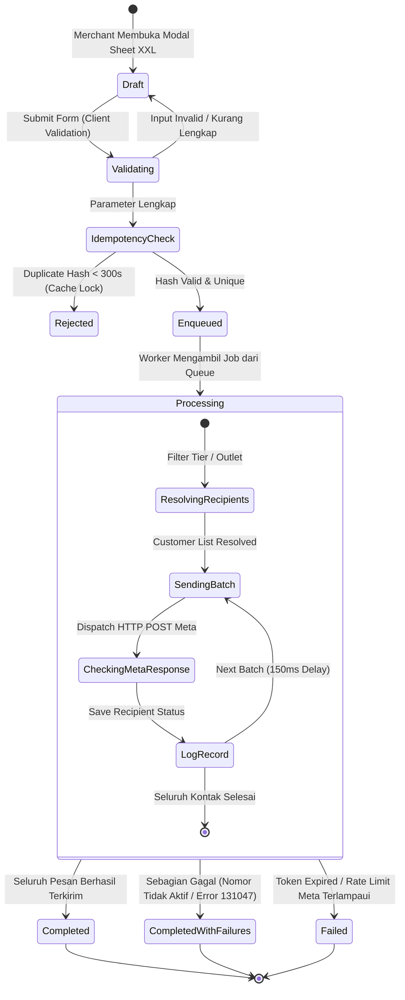

# Alur Kerja WhatsApp Gateway, Struk Kasir POS & Broadcast Promosi (WhatsApp Gateway & Broadcast Flow)

> **Status:** COMPLETE  
> **Domain Terkait:** `app/Domain/WhatsApp/`, `app/Domain/Pos/`, `app/Domain/Customer/`, `app/Domain/Billing/`, `app/Exports/`  
> **Controller Terkait:** `WhatsAppWebController`, `WhatsAppBroadcastWebController`, `MetaWhatsAppOnboardingController`, `PosTerminalWebController`  
> **View Terkait:** `resources/views/app/whatsapp/index.blade.php`, `broadcast.blade.php`, `broadcast_detail.blade.php`, `logs.blade.php`  
> **Export Engine:** `App\Exports\WhatsAppLogsExport` (Two-Part Multi-Sheet Excel Engine)  
> **Job & Event:** `App\Jobs\WhatsApp\SendWhatsAppBroadcastJob`  
> **Tabel Basis Data:** `whatsapp_accounts`, `whatsapp_sessions`, `whatsapp_broadcast_campaigns`, `whatsapp_broadcast_recipients`, `whatsapp_message_logs`, `pos_orders`, `locations`, `customers`  
> **Test Suite:** `tests/Feature/WhatsApp/MerchantWhatsAppWebFeatureTest.php`, `tests/Feature/WhatsApp/WhatsAppLogsExportTest.php` (61 Tests, 428 Assertions)

---

## 1. Ikhtisar Alur Kerja (Workflow Overview)

Modul **WhatsApp Gateway & Otomasi Komunikasi** (`resources/views/app/whatsapp`) adalah tulang punggung interaksi langsung antara merchant Cooca dan pelanggan akhir (*customer-facing communication engine*). Modul ini menjalankan 6 pilar arsitektur utama:

1. **Otorisasi & Onboarding Resmi Meta Cloud API (Graph API v26.0):** Pendaftaran mandiri 1-klik (*Embedded Signup via Facebook SDK*) untuk menautkan WhatsApp Business Account (WABA) toko tanpa pembuatan aplikasi Facebook manual.
2. **Keamanan Kredensial & Enkripsi Token:** Enkripsi simetris ciphertext pada `meta_access_token` melalui Eloquent attribute cast `'encrypted'`, serta penyembunyian token dari serialisasi JSON/Array (`$hidden`) untuk mencegah kebocoran kredensial gateway.
3. **Otomasi Struk Digital POS (Paperless Receipt):** Pengiriman gambar struk belanja beresolusi tinggi beserta teks sambutan personal seketika setelah kasir menyelesaikan transaksi pembayaran di terminal kasir POS.
4. **Penyusunan & Distribusi Broadcast Promosi Massal (Multi-Tier & Multi-Outlet):**
   - Segmentasi audiens ganda: Berdasarkan *Membership Tier* (All, Bronze, Silver, Gold, VIP) maupun *Multi-Outlet / Multi-Branch* (`outlet:{location_id}`) berbasis riwayat transaksi POS.
   - Simulator smartphone live WYSIWYG reaktif dengan tag personalisasi 20 sektor industri.
   - Antrean latar belakang ber-throttle (jeda aman 150ms antar pesan) dengan kunci idempoten (*Idempotency Lock 300s*).
5. **Dua-Part Multi-Sheet Excel Export Engine:** Mesin generator laporan XLSX profesional dengan Sheet 1 (Executive KPI Dashboard dengan formula kalkulasi live) dan Sheet 2 (Transactional Delivery Ledger dengan freeze panes & auto-filter).
6. **Audit Trail, PII Privacy Masking & Storage Pruning:** Pencatatan transaksional seluruh riwayat keluar, masking nomor telepon pelanggan (`0812••••7890`) untuk peran non-owner, kalkulasi estimasi pembersihan log lama (> 90 hari), dan standardisasi Apple HIG Touch Ergonomics (min 44×44px tap target) & WCAG 2.1 Level AA.

---

## 2. Diagram Rantai 11-Node Hulu-ke-Hilir (End-to-End Execution Flow)

```text
┌───────────────────────────────────────────────────────────────────────────────────────────────────┐
│ [Node 1] Aksi Pengguna / Pemicu Sistem (User Trigger)                                             │
│ - Kasir klik [Selesai Bayar] di POS (Auto-Send Struk POS Digital)                                 │
│ - Owner menyusun kampanye blast di modal [Buat Kampanye Blast Promosi] (Template / Free Text)     │
│ - Owner memilih target audiens: Tier Member (All/VIP/dll) ATAU Cabang Spesifik (outlet:UUID)      │
│ - Admin/Owner klik [Kirim Pesan Tes] di konsol pengujian gateway                                  │
│ - Owner menautkan nomor toko via [Hubungkan dengan WhatsApp Resmi (1-Klik Meta)]                  │
│ - Owner mengunduh laporan multi-sheet via [Ekspor Excel] atau membuka modal [Storage Pruning]     │
└────────────────────────────────────────────────┬──────────────────────────────────────────────────┘
                                                 │
                                                 ▼
┌───────────────────────────────────────────────────────────────────────────────────────────────────┐
│ [Node 2] Frontend Blade UI & Alpine.js Simulator (WYSIWYG & Ergonomi Sentuh)                      │
│ - Live Smartphone Simulator (Dynamic Island / Notch Frame, balon chat hijau WA, centang dua Meta) │
│ - Real-time variable replacement preview ({nama}, {poin}, {tier}, {nopol}, {meja}, {bisnis})      │
│ - Segmented quick-switch audiens (Tier vs Outlet) dengan counter kontak reaktif                   │
│ - Apple HIG Touch Ergonomics: min-h-[44px] pada seluruh tombol, toggle, tabs & close modal sheets │
│ - WCAG 2.1 AA Semantics: role="dialog", aria-modal="true", aria-labelledby, & aria-label          │
│ - Status badge koneksi WABA (GREEN / YELLOW / RED quality rating & messaging tier limit)          │
│ - Quiet Hours Warning (21:00 - 08:00 WIB) & Meta/BPOM Pharmacy Policy Warning                     │
└────────────────────────────────────────────────┬──────────────────────────────────────────────────┘
                                                 │
                                                 ▼
┌───────────────────────────────────────────────────────────────────────────────────────────────────┐
│ [Node 3] Lapisan Route & Middleware Keamanan (Security Gateways)                                  │
│ - `auth:web`: Verifikasi sesi login aktif merchant                                               │
│ - `business.active`: Penguncian tenant aktif                                                      │
│ - `require.permission:whatsapp.view|whatsapp.manage`: Pengamanan otorisasi peran RBAC            │
│ - `entitlement:whatsapp`: Pengecekan limitasi paket langganan SaaS Cooca                          │
│ - `throttle:5,1`: Pembatasan laju uji coba pengiriman pesan konsol                                │
└────────────────────────────────────────────────┬──────────────────────────────────────────────────┘
                                                 │
                                                 ▼
┌───────────────────────────────────────────────────────────────────────────────────────────────────┐
│ [Node 4] Web Controller Dispatcher                                                                │
│ - `WhatsAppWebController`: Pengaturan struk POS, test send, inspeksi log, & ekspor Excel multi-sheet│
│ - `WhatsAppBroadcastWebController`: Estimasi audiens, validasi outlet, & orkestrasi kampanye blast│
│ - `MetaWhatsAppOnboardingController`: Tukar authorization code Meta SDK ke Long-Lived Token       │
└────────────────────────────────────────────────┬──────────────────────────────────────────────────┘
                                                 │
                                                 ▼
┌───────────────────────────────────────────────────────────────────────────────────────────────────┐
│ [Node 5] Validasi Input & Sanitasi Muatan (Validation Layer)                                      │
│ - Idempotency Lock: Hash md5(business_id:title:message) dikunci di Cache selama 300 detik         │
│ - Target Filter: Validasi in_array('all', 'bronze', ...) ATAU validasi outlet milik tenant        │
│ - Nomor telepon dibersihkan ke format E.164 (08xxx / +62xxx -> 628xxx)                            │
│ - SSRF Guard pada Media URL: Wajib https://, memblokir privat/loopback IP (127.0.0.1, 169.254.x.x)│
│ - Panjang pesan dibatasi maksimal 2.000 karakter                                                  │
└────────────────────────────────────────────────┬──────────────────────────────────────────────────┘
                                                 │
                                                 ▼
┌───────────────────────────────────────────────────────────────────────────────────────────────────┐
│ [Node 6] Scoping Multi-Tenant & Anti-IDOR Guard                                                   │
│ - Seluruh query di-bind eksplisit ke `Context::requireBusiness()->id`                             │
│ - Validasi lokasi cabang memverifikasi `Location::where('business_id', $business->id)`           │
│ - `PosOrder`, `Customer`, `WhatsAppAccount`, `WhatsAppBroadcastCampaign` terisolasi 100%          │
└────────────────────────────────────────────────┬──────────────────────────────────────────────────┘
                                                 │
                                                 ▼
┌───────────────────────────────────────────────────────────────────────────────────────────────────┐
│ [Node 7] Layanan Domain (Domain Service Layer)                                                    │
│ - `WhatsAppGatewayService`: Orkestrator pengiriman, anti-duplicate cache lock 60s, kuota resolver │
│ - `WhatsAppGatewayService@resolveBroadcastRecipients`: Resolusi audiens tier vs riwayat POS outlet│
│ - `WhatsAppTemplateService`: Penyusun template resmi Meta (Utility Struk & Marketing Blast)       │
│ - `PosReceiptImageService`: Generator gambar struk digital PNG (58mm/80mm)                        │
└────────────────────────────────────────────────┬──────────────────────────────────────────────────┘
                                                 │
                                                 ▼
┌───────────────────────────────────────────────────────────────────────────────────────────────────┐
│ [Node 8] Antrean Asinkron Latar Belakang (Laravel Queue Offloading)                               │
│ - `SendWhatsAppBroadcastJob`: Diproses di worker background (timeout 600 detik)                   │
│ - Throttling rate-limiting 150ms per pesan untuk mematuhi limit Meta Cloud API                    │
└────────────────────────────────────────────────┬──────────────────────────────────────────────────┘
                                                 │
                                                 ▼
┌───────────────────────────────────────────────────────────────────────────────────────────────────┐
│ [Node 9] Pengiriman Gateway Eksternal (External Meta Cloud API)                                   │
│ - Meta WhatsApp Cloud API (Graph API v26.0): Request HTTP POST ke `/{phone_number_id}/messages`   │
│ - Header Authorization: Bearer {encrypted_meta_access_token}                                      │
│ - Mandatory Template Mode: Pengiriman template approved Meta untuk pesan proaktif outbound        │
└────────────────────────────────────────────────┬──────────────────────────────────────────────────┘
                                                 │
                                                 ▼
┌───────────────────────────────────────────────────────────────────────────────────────────────────┐
│ [Node 10] Pencatatan Transaksional & Jejak Audit (Audit Trail & Telemetry)                        │
│ - `whatsapp_message_logs`: Menyimpan status `sent` / `failed`, error message, & recipient phone  │
│ - `whatsapp_broadcast_recipients`: Status detail per penerima kampanye                           │
│ - PII Protection: Nomor HP disamarkan (`0812••••7890`) pada antarmuka staf non-owner              │
│ - `QuotaMonthlyUsage`: Increment kuota bulanan tenant                                            │
└────────────────────────────────────────────────┬──────────────────────────────────────────────────┘
                                                 │
                                                 ▼
┌───────────────────────────────────────────────────────────────────────────────────────────────────┐
│ [Node 11] Respons UI Real-Time & Feedback Visual (Feedback Loop)                                 │
│ - Polling live status kampanye (`/whatsapp/broadcast/{id}` via JSON) setiap 3 detik              │
│ - Bento KPI Grid: Total Target, Berhasil Terkirim, Gagal Terkirim, Tingkat Sukses (%)             │
│ - Tombol Fallback Manual: Buka WhatsApp Web / HP (`https://wa.me/...`) jika nomor tujuan bermasalah│
│ - Dua-Sheet Excel Export (`WhatsAppLogsExport.php`) untuk rekonsiliasi manajemen eksekutif       │
└───────────────────────────────────────────────────────────────────────────────────────────────────┘
```

---

## 3. Diagram State Machine & Siklus Hidup Kampanye Broadcast



---

## 4. Spesifikasi Dua-Part Multi-Sheet Excel Engine

Sistem ekspor log WhatsApp menggunakan `App\Exports\WhatsAppLogsExport` yang menghasilkan berkas `.xlsx` terstruktur standar Apple HIG:

```
Nama File: Laporan_Komunikasi_WhatsApp_[NamaBisnis]_[YYYYMMDD].xlsx

┌─────────────────────────────────────────────────────────────────────────────────┐
│ SHEET 1: RINGKASAN EKSEKUTIF & KPI (Executive Summary Dashboard)                │
├─────────────────────────────────────────────────────────────────────────────────┤
│ [A1] Header Formal Tenant: Nama Bisnis, Periode Laporan, Waktu Export (WIB)     │
│ [A3:D6] Bento KPI Grid (#F2F2F7, Border halus #E5E5EA, Text Bold):              │
│   • Total Pesan Terkirim: 14.850 (Tabular Numbers)                              │
│   • Delivery Success Rate: 99.2% (System Green #34C759)                         │
│   • Struk POS Terdistribusi: 11.200 Pesan                                       │
│   • Siaran Promosi Blast: 3.650 Pesan                                           │
│ [A8:F16] Tabel Agregasi Distribusi Komunikasi per Kategori & Status (=SUM)      │
└─────────────────────────────────────────────────────────────────────────────────┘

┌─────────────────────────────────────────────────────────────────────────────────┐
│ SHEET 2: RINCIAN LOG LENGKAP (Transactional Delivery Ledger)                    │
├─────────────────────────────────────────────────────────────────────────────────┤
│ [A1] Judul Buku Transaksi: Log Komunikasi Pesan Keluar Terperinci              │
│ [A4:H4] Table Headers (Dark Onyx #1C1C1E, Text White, Freeze Panes di A5):      │
│   1. ID Transaksi Pesan                                                         │
│   2. Waktu Pengiriman (DD/MM/YYYY HH:MM:SS WIB)                                 │
│   3. Nama Penerima                                                              │
│   4. Nomor WhatsApp (Masked PII untuk non-owner / Full untuk Owner)             │
│   5. Tipe Pesan (Struk POS / Blast Promosi / Uji Tes)                           │
│   6. Nama Template Resmi Meta                                                   │
│   7. Status Pengiriman (Terkirim / Gagal)                                       │
│   8. Keterangan / Diagnostic Error Message                                      │
│ [A5:Hn] Zebra Striping (#FAFAFA & White), Number Format Asli, AutoFilter Aktif  │
└─────────────────────────────────────────────────────────────────────────────────┘
```

---

## 5. Matriks Do's & Don'ts untuk 20 Sektor Industri Bisnis

| Klaster Industri | Sektor Usaha | Do's (Praktik Terbaik & Wajib Terap) | Don'ts (Larangan Keras / Haram) |
|---|---|---|---|
| **1. Kuliner & F&B (5)** | • Restoran / Rumah Makan<br/>• Cafe & Coffee Shop<br/>• Bakery & Cake Shop<br/>• Cloud Kitchen<br/>• Katering & Prasmanan | • Tampilkan rincian pesanan, nomor meja dine-in / take-away pada struk.<br/>• Blast promo saat jam santai (10:00–11:30 atau 15:30–17:00).<br/>• Gunakan tag personal `{nama}`, `{poin}`, `{meja}`. | • **DILARANG** mengirim blast promosi di atas pukul 21:00 atau sebelum 08:00 WIB (Quiet Hours).<br/>• Dilarang mengirim blast menu tanpa foto banner yang menggugah selera.<br/>• Dilarang mengirim struk tanpa detail item makanan yang dipesan. |
| **2. Manufaktur & HPP (5)** | • Konveksi & Garment<br/>• Logam & Plastik Presisi<br/>• Mebel & Kayu<br/>• Kerajinan Tangan<br/>• Percetakan & Offset | • Notifikasi Surat Perintah Kerja (`{no_spk}`) & produk (`{produk}`) selesai.<br/>• Pemberitahuan barang jadi siap kirim/ambil.<br/>• Pengiriman faktur invoice termin pembayaran (Down Payment / Pelunasan). | • **HARAM** mengirim blast promosi ritel generik bertuliskan "Tunjukkan pesan ini ke kasir" (tidak relevan dengan B2B/maklon).<br/>• Dilarang mengirim pesan tanpa konfirmasi nomor SPK/PO. |
| **3. Ritel & Apotek (2)** | • Reseller & Minimarket<br/>• Apotek & Toko Obat | • Struk kasir digital lengkap dengan nomor batch & masa kadaluarsa (Apotek).<br/>• Notifikasi tebus obat racikan siap diambil (`{no_resep}`).<br/>• Pengingat pengobatan rutin (Refill Reminder H-3). | • **HARAM MUTLAK** mempromosikan obat keras (Daftar G), antibiotik, atau obat resep via blast promosi (Melanggar Meta Health Policy & Regulasi BPOM RI - sanksi hukum dan ban permanen WABA!). |
| **4. Jasa Operasional (4)** | • Bengkel Mobil & Motor<br/>• Barbershop & Salon<br/>• Laundry Kiloan & Satuan<br/>• Auto Detailing | • Bengkel: Notifikasi kendaraan selesai diservis (`{nopol}`), Pengingat Servis Berkala (`{servis_terakhir}`).<br/>• Laundry: Notifikasi cucian selesai dengan nomor rak simpan (`{no_rak}`) & berat (`{berat_kg}`). | • **HARAM** mengirim pesan servis bengkel tanpa nomor polisi kendaraan (`{nopol}`).<br/>• Laundry: Dilarang mengirim pesan siap ambil tanpa nomor rak penyimpanan fisik.<br/>• Dilarang mengirim blast massal tanpa opsi unsubscribe. |
| **5. Jasa Proyek (3)** | • Kontraktor Bangunan<br/>• Event Organizer & WO<br/>• Digital Agency / IT | • Update laporan mingguan progres fisik proyek (`{proyek}`).<br/>• Notifikasi tagihan termin invoice (`{termin}`).<br/>• WO: Notifikasi konfirmasi rundown & briefing. | • **HARAM** memunculkan istilah struk kasir ritel "kasir POS" pada bisnis kontraktor/agency.<br/>• Dilarang mengirim pesan promosi massal acak ke klien korporasi B2B. |
| **6. Distribusi & Agro (2)** | • Distributor FMCG<br/>• Peternakan & Pertanian | • Konfirmasi Delivery Order (DO) armada truk berangkat.<br/>• Salinan Surat Jalan digital dan rincian karton barang.<br/>• Rekap tagihan piutang toko jatuh tempo. | • **HARAM** mengirim pesan berformat kasir meja restoran dine-in.<br/>• Dilarang mengirim pesan tanpa nomor faktur penjualan resmi. |

---

## 6. Keamanan Cyber, Proteksi Fraud & Mitigasi Human Error

### 6.1 Celah Keamanan Cyber & Mitigasi
1. **SSRF Guard pada Media Banner:**
   - Parameter `media_url` divalidasi ketat: wajib berawalan `https://`, menolak IP loopback/lokal (`127.0.0.1`, `10.x.x.x`, `192.168.x.x`, `169.254.169.254`), dan memvalidasi resolusi DNS publik.
2. **Anti-Toll Fraud & Rate Limiting Konsol Uji Coba:**
   - Endpoint `POST /whatsapp/test` dikawal middleware `throttle:5,1` (maksimal 5 pesan per menit per user) untuk mencegah spam bombing.
3. **Penyembunyian Data Pribadi (PII Masking):**
   - Nomor telepon pelanggan disamarkan (`0812••••7890`) bagi staf non-owner pada seluruh tabel tampilan dan file ekspor Excel.
4. **Enkripsi Kredensial Meta:**
   - `meta_access_token` tersimpan dalam bentuk ciphertext terenkripsi di basis data dan disembunyikan dari representasi JSON/Array model.

### 6.2 Skema Fraud Internal & Mitigasi
1. **Pencegahan Pengalihan Struk Kasir (Receipt Redirection Fraud):**
   - Nomor telepon tujuan struk terkunci otomatis ke kontak pelanggan terdaftar. Jika kasir mengalihkan nomor ke pihak ketiga, sistem mencatat log ke `audit_logs` dengan flag `suspicious_receipt_redirect`.
2. **Pencegahan Rekening Palsu pada Broadcast:**
   - Heuristik sistem memindai teks pesan sebelum dijadwalkan dan memblokir nomor rekening yang tidak cocok dengan master rekening resmi Cooca.
3. **Pencegahan Cross-Tenant Outlet Targeting (IDOR):**
   - Validasi `store()` dan `estimateRecipients()` memverifikasi kepemilikan `location_id` terhadap `business_id` aktif.

### 6.3 Perlindungan Human Error
1. **Idempotency Lock (300 Detik):** Mencegah penembakan broadcast massal ganda akibat klik berulang.
2. **Quiet Hours Warning (21:00 - 08:00 WIB):** Peringatan otomatis agar merchant tidak mengirim blast di malam hari yang memicu report spam.
3. **Pembersih Otomatis Format Nomor HP:** Mengonversi nomor HP awalan `08...` atau `+62...` menjadi `628...` secara mulus.
4. **Pencegahan Double-Submit:** State `submitting` pada tombol aksi menonaktifkan klik ganda saat proses penjadwalan berjalan.

---

## 7. Definition of Done & Verifikasi Pengujian Otomatis

Setiap modifikasi modul WhatsApp wajib memenuhi kriteria kepatuhan mutlak:
1. `php -l` seluruh controller, job, model, export, dan view Blade bebas dari syntax error.
2. Seluruh pengujian fitur di `tests/Feature/WhatsApp/` dan `tests/Feature/ComprehensiveLocalizationAndErgonomicsTest.php` **100% LULUS (GREEN)**.
3. Pengujian isolasi multi-tenant memastikan tidak ada kebocoran data antar-bisnis.
4. Nilai rasio kontras warna memenuhi standar WCAG AA (≥ 4.5:1) dan ergonomi sentuh memenuhi Apple HIG (`min-h-[44px]`).
5. Paritas kamus bahasa `lang/id/whatsapp.php` dan `lang/en/whatsapp.php` bernilai 100% identik tanpa teks hardcoded.
